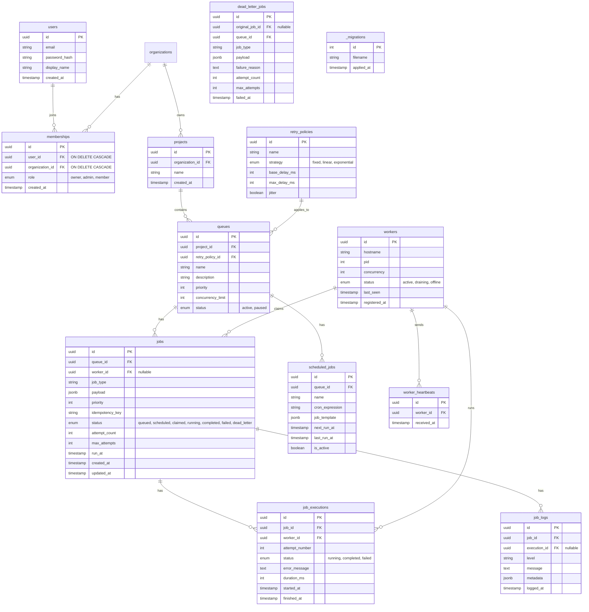

# Entity Relationship Diagram

```mermaid
erDiagram
    users ||--o{ memberships : "joins"
    organizations ||--o{ memberships : "has"
    organizations ||--o{ projects : "owns"

    users {
        uuid id PK
        string email
        string password_hash
        string display_name
        timestamp created_at
    }

    memberships {
        uuid id PK
        uuid user_id FK "ON DELETE CASCADE"
        uuid organization_id FK "ON DELETE CASCADE"
        enum role "owner, admin, member"
        timestamp created_at
    }

    projects {
        uuid id PK
        uuid organization_id FK
        string name
        timestamp created_at
    }

    projects ||--o{ queues : "contains"
    retry_policies ||--o{ queues : "applies_to"

    retry_policies {
        uuid id PK
        string name
        enum strategy "fixed, linear, exponential"
        int base_delay_ms
        int max_delay_ms
        boolean jitter
    }

    queues {
        uuid id PK
        uuid project_id FK
        uuid retry_policy_id FK
        string name
        string description
        int priority
        int concurrency_limit
        enum status "active, paused"
    }

    queues ||--o{ jobs : "has"
    queues ||--o{ scheduled_jobs : "has"

    jobs {
        uuid id PK
        uuid queue_id FK
        uuid worker_id FK "nullable"
        string job_type
        jsonb payload
        int priority
        string idempotency_key
        enum status "queued, scheduled, claimed, running, completed, failed, dead_letter"
        int attempt_count
        int max_attempts
        timestamp run_at
        timestamp created_at
        timestamp updated_at
    }

    scheduled_jobs {
        uuid id PK
        uuid queue_id FK
        string name
        string cron_expression
        jsonb job_template
        timestamp next_run_at
        timestamp last_run_at
        boolean is_active
    }

    workers {
        uuid id PK
        string hostname
        int pid
        int concurrency
        enum status "active, draining, offline"
        timestamp last_seen
        timestamp registered_at
    }

    workers ||--o{ worker_heartbeats : "sends"
    workers ||--o{ jobs : "claims"

    worker_heartbeats {
        uuid id PK
        uuid worker_id FK
        timestamp received_at
    }

    jobs ||--o{ job_executions : "has"
    workers ||--o{ job_executions : "runs"

    job_executions {
        uuid id PK
        uuid job_id FK
        uuid worker_id FK
        int attempt_number
        enum status "running, completed, failed"
        text error_message
        int duration_ms
        timestamp started_at
        timestamp finished_at
    }

    jobs ||--o{ job_logs : "has"

    job_logs {
        uuid id PK
        uuid job_id FK
        uuid execution_id FK "nullable"
        string level
        text message
        jsonb metadata
        timestamp logged_at
    }

    dead_letter_jobs {
        uuid id PK
        uuid original_job_id FK "nullable"
        uuid queue_id FK
        string job_type
        jsonb payload
        text failure_reason
        int attempt_count
        int max_attempts
        timestamp failed_at
    }

    _migrations {
        int id PK
        string filename
        timestamp applied_at
    }
```
